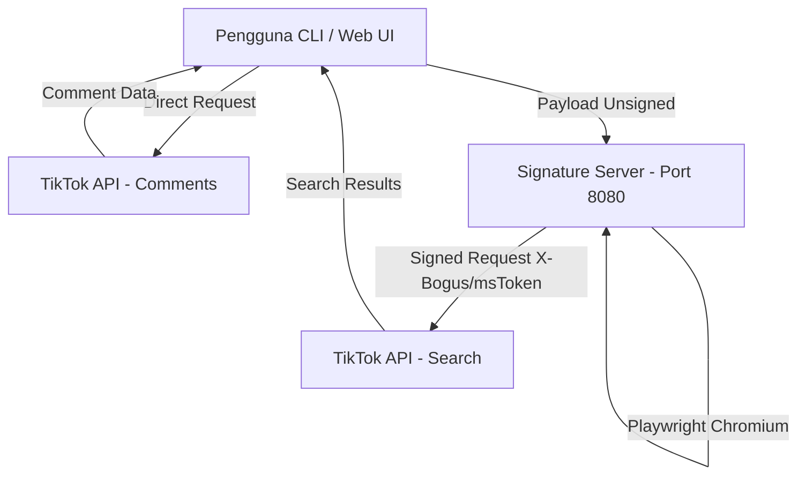

# 🎵 TikTok Crawl & Scraper Suite


Project ini menyediakan alat scraping TikTok melalui **Script CLI** dan **Antarmuka Web (Flask)** untuk mengambil komentar, mencari video berdasarkan kata kunci, serta alur kerja kombinasi (*crawl* video & komentar) dalam satu tempat.

---

## 📌 Daftar Isi
- [Fitur Utama](#-fitur-utama)
- [Arsitektur Sistem](#-arsitektur-sistem)
- [Prasyarat & Instalasi](#-prasyarat--instalasi)
- [Persiapan Signature Server](#-persiapan-signature-server-wajib-untuk-search)
- [Penggunaan CLI Script](#-penggunaan-cli-script)
- [Penggunaan Website Flask](#-penggunaan-website-flask)
- [Struktur Project](#-struktur-project)
- [Format Output Data](#-format-output-data)
- [Konfigurasi Environment](#-konfigurasi-environment)
- [Troubleshooting](#-troubleshooting)
- [Disclaimer](#-disclaimer)

---

## ✨ Fitur Utama

| Fitur | CLI Script | Website UI | Butuh Signature Server? | Output Format |
| :--- | :---: | :---: | :---: | :---: |
| **Scrape Komentar** | [`1 - scraping komen.py`](1%20-%20scraping%20komen.py) | Route `/comments` | ❌ Tidak | `.xlsx` / JSON / UI |
| **Search Video** | [`2 - scraping video.py`](2%20-%20scraping%20video.py) | Route `/video` | ✅ Ya | `.json` / UI |
| **Crawl Komplit** | [`3 - crawl komen.py`](3%20-%20crawl%20komen.py) | Route `/crawl` | ✅ Ya | `.xlsx` / UI |

---

## 🏗️ Arsitektur Sistem



---

## ⚙️ Prasyarat & Instalasi

### 1. Prasyarat System
- Python 3.8 atau lebih baru
- `pip` dan `git`

### 2. Buat Virtual Environment (Direkomendasikan)
```bash
python -m venv venv
# Linux/macOS
source venv/bin/activate
# Windows
venv\Scripts\activate
```

### 3. Install Dependency Root (CLI)
```bash
pip install requests pandas openpyxl
```

---

## 🔑 Persiapan Signature Server (Wajib untuk Search)

Pencarian video (baik CLI maupun Web) memerlukan signature token (X-Bogus, msToken). Server ini berjalan secara terpisah menggunakan Playwright.

1. **Clone dan install signature server di terminal terpisah**:
   ```bash
   git clone https://github.com/afrzlfaiz/tiktok-signature-python.git
   cd tiktok-signature-python
   pip install -r requirements.txt
   python -m playwright install chromium
   python main.py
   ```
2. **Verifikasi Server Status**:
   ```bash
   curl http://localhost:8080/health
   # Response: {"status":"ok", ...}
   ```

> 💡 **Catatan**: `1 - scraping komen.py` tidak memerlukan Signature Server karena endpoint komentar dipanggil secara langsung.

---

## 💻 Penggunaan CLI Script

Semua skrip CLI mendukung mode interaktif di terminal:

### 1. Scraping Komentar Video
```bash
python "1 - scraping komen.py"
```
* **Input**: Link Video TikTok atau Video ID (contoh: `7123456789...`)
* **Parameter**: Jumlah komentar & Opsi menyertakan balasan (*replies*).

### 2. Cari Video Berdasarkan Keyword
```bash
python "2 - scraping video.py"
```
* **Input**: Keyword pencarian (contoh: `kuliner jakarta`)
* **Output**: Disimpan sebagai file `.json` di folder aktif.

### 3. Crawl Komplit (Keyword ➔ Video ➔ Komentar)
```bash
python "3 - crawl komen.py"
```
* **Input**: Keyword, Jumlah Video, dan Maksimal Komentar per Video.
* **Output**: File Excel `.xlsx` gabungan seluruh data video dan komentar.

---

## 🌐 Penggunaan Website Flask

1. Masuk ke direktori `WEBSITE`:
   ```bash
   cd WEBSITE
   ```
2. Install dependency khusus website:
   ```bash
   pip install -r requirements.txt
   ```
3. Jalankan aplikasi Flask:
   ```bash
   python app.py
   ```
4. Buka browser di `http://127.0.0.1:5000`

---

## 📂 Struktur Project

```text
.
├── 1 - scraping komen.py     # Script CLI scrape komentar saja
├── 2 - scraping video.py     # Script CLI search video via keyword
├── 3 - crawl komen.py        # Script CLI workflow gabungan video + komentar
├── README.md                 # Dokumentasi proyek
└── WEBSITE/                  # Aplikasi Web Flask
    ├── app.py                # Main Flask entrypoint
    ├── requirements.txt      # Dependency Flask app
    ├── outputs/              # Direktori file hasil scraping UI
    ├── services/             # Logic service (comments, video, crawl)
    ├── static/               # CSS, JS, Assets
    └── templates/            # HTML Templates (Jinja2)
```

---

## 📄 Format Output Data

### Skema Data Komentar (`.xlsx`)
| Nama Kolom | Deskripsi | Contoh |
| :--- | :--- | :--- |
| `type` | Tipe komentar (`main` / `reply`) | `main` |
| `username` | Username akun pembuat komentar | `@user123` |
| `nickname` | Nama tampilan pengguna | `John Doe` |
| `text` | Isi teks komentar | `Keren banget videonya!` |
| `create_time` | Waktu posting komentar | `2026-08-16 10:00:00` |
| `digg_count` | Jumlah like pada komentar | `42` |
| `reply_comment_total` | Jumlah balasan pada komentar | `5` |

---

## 🛠️ Konfigurasi Environment

Aplikasi mendukung konfigurasi via Environment Variables:

| Variable | Default Value | Keterangan |
| :--- | :--- | :--- |
| `TIKTOK_SIGNATURE_URL` | `http://localhost:8080` | URL tempat Signature Server berjalan |
| `SECRET_KEY` | `tiktok-scraper-dev` | Flask secret key untuk session |

---

## ❓ Troubleshooting

* **`Connection Error / 500` saat Search Video**: Pastikan Signature Server di `http://localhost:8080` sudah dinyalakan dan status `/health` bernilai `"ok"`.
* **Data Kosong / 0 Result**: TikTok mungkin memberikan respon challenge/anti-bot. Coba tunggu beberapa saat atau ubah keyword pencarian.

---

## ⚠️ Disclaimer

Project ini dibuat semata-mata untuk **tujuan edukasi, penelitian data, dan pembelajaran akademis**. Pengguna bertanggung jawab penuh atas penggunaan skrip ini dan wajib mematuhi ketentuan layanan (*Terms of Service*) TikTok serta hukum privasi data yang berlaku.
